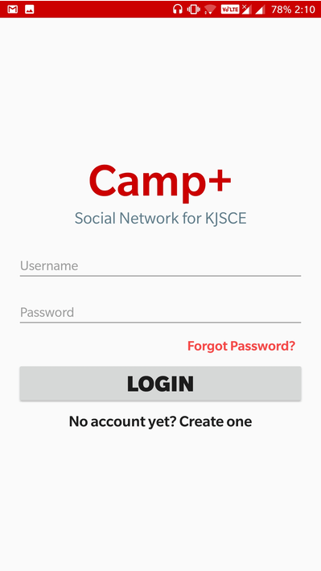

# camplus-social-network-for-campus

## Summary

Camp+ is a social networking android application which aims to bridge the gap between inquisitive students seeking help
or insight with regard to academics, placements, internships, online courses, etc. It provides a platform for exchange
of ideas and information.  
The application is coded in Java using Android Studio. The backend comprises MySQL database hosted on 000WebHost.
Firebase is used for real time messaging and PHP for server side scripting.

 

## Output

 

## Entity Relationship Diagram:

 

## Technologies/Languages used:

- Java
- XML
- MySQL
- PHP
- Android Studio
- 000WebHost
- Firebase
